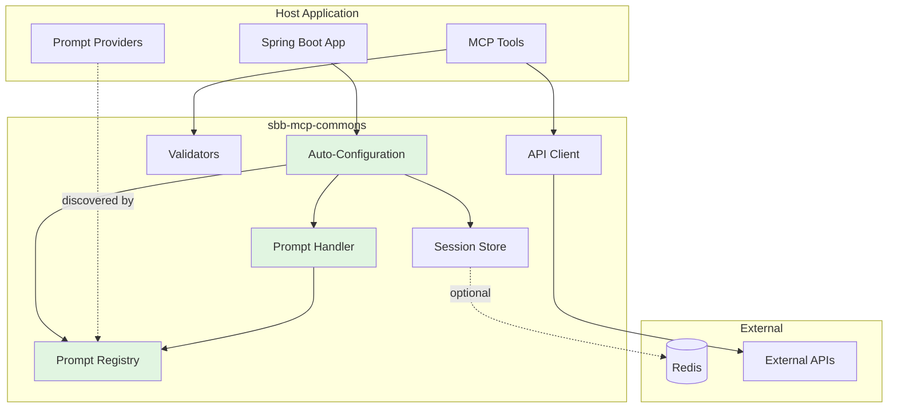

# SBB MCP Commons

[](https://github.com/schlpbch/sbb-mcp-commons)
[](https://github.com/schlpbch/sbb-mcp-commons)
[](https://openjdk.org/)
[](https://spring.io/projects/spring-boot)

Shared infrastructure library for SBB Model Context Protocol (MCP) servers, providing reusable components for building production-ready MCP services.

## 🎯 Overview

`sbb-mcp-commons` is a comprehensive Spring Boot library that provides:

- **🔧 Auto-Configuration** - Zero-configuration Spring Boot integration
- **💬 Prompt Infrastructure** - MCP prompt discovery and handling
- **📦 Session Management** - Stateful reactive session store with Redis support
- **⚠️ Exception Handling** - Standardized MCP error responses
- **✅ Validation Framework** - Reusable input validators
- **🔄 API Client** - Resilient HTTP client with retry and circuit breaker
- **🗺️ GeoJSON Utilities** - Geometry validation and processing
- **🛠️ Utilities** - Date/time parsing, argument extraction, and more

## 📚 Documentation

- [Architecture Overview](docs/architecture/README.md) - System design and component interactions
- [Quick Start Guide](docs/guides/quick-start.md) - Get started in 5 minutes
- [Auto-Configuration Guide](docs/guides/auto-configuration.md) - Understanding Spring Boot integration
- [Prompt Infrastructure](docs/guides/prompts.md) - Building MCP prompts
- [Session Management](docs/guides/sessions.md) - Managing stateful sessions
- [API Reference](docs/api/README.md) - Complete API documentation

## 🚀 Quick Start

### Installation

#### Option 1: GitHub Packages (Recommended)

This library is published to GitHub Packages. Add to your `pom.xml`:

```xml
<dependency>
    <groupId>ch.sbb.mcp</groupId>
    <artifactId>sbb-mcp-commons</artifactId>
    <version>1.8.0</version>
</dependency>
```

**Authentication Required:** Configure your `~/.m2/settings.xml`:

```xml
<settings>
    <servers>
        <server>
            <id>github</id>
            <username>YOUR_GITHUB_USERNAME</username>
            <password>YOUR_GITHUB_TOKEN</password>
        </server>
    </servers>
</settings>
```

Add the repository to your `pom.xml`:

```xml
<repositories>
    <repository>
        <id>github</id>
        <url>https://maven.pkg.github.com/schlpbch/sbb-mcp-commons</url>
    </repository>
</repositories>
```

> **Note:** You need a GitHub Personal Access Token with `read:packages` scope. [Create one here](https://github.com/settings/tokens/new?scopes=read:packages).

#### Option 2: Local Installation

Clone and install locally:

```bash
git clone https://github.com/schlpbch/sbb-mcp-commons.git
cd sbb-mcp-commons
mvn clean install
```

### Basic Usage

#### 1. Auto-Configuration (Zero Config!)

Simply add the dependency - beans are auto-configured:

```java
@SpringBootApplication
public class MyMcpServer {
    public static void main(String[] args) {
        SpringApplication.run(MyMcpServer.class, args);
    }
}
```

#### 2. Define Prompts

```java
@Component
public class MyPrompts implements McpPromptProvider {
    @Override
    public List<McpPrompt> getPrompts() {
        return List.of(
            new McpPrompt(
                "find-journey",
                "Find train journeys between stations",
                List.of(
                    new McpPromptArgument("from", "Origin station", true),
                    new McpPromptArgument("to", "Destination station", true)
                ),
                "Find train journeys from {from} to {to}"
            )
        );
    }
}
```

#### 3. Handle MCP Requests

```java
@RestController
public class McpController {
    
    private final McpPromptHandler promptHandler;
    
    @PostMapping("/mcp")
    public Mono<McpResponse> handleMcp(@RequestBody McpRequest request) {
        return switch (request.method()) {
            case "prompts/list" -> promptHandler.handlePromptsList(request);
            case "prompts/get" -> promptHandler.handlePromptsGet(request);
            default -> Mono.just(McpResponse.error(
                request.id(),
                McpResponse.McpError.methodNotFound(request.method())
            ));
        };
    }
}
```

## 🏗️ Architecture



## 📦 Core Components

### Auto-Configuration

Automatic Spring Boot integration - no manual bean registration required:

- `McpPromptAutoConfiguration` - Prompt infrastructure
- `McpSessionAutoConfiguration` - Session management

### Prompt Infrastructure

- `McpPromptRegistry` - Auto-discovers and registers prompts
- `McpPromptHandler` - Handles `prompts/list` and `prompts/get` requests
- `McpPromptProvider` - Interface for defining prompts

### Session Management

- `McpSessionStore` - Reactive session storage interface
- `InMemoryMcpSessionStore` - In-memory implementation (default)
- `RedisMcpSessionStore` - Redis-backed implementation (auto-configured when Redis is available)

### Exception Handling

- `McpException` - Base exception with MCP error codes
- `McpValidationException` - Validation errors (-32602)
- `McpResourceNotFoundException` - Resource not found (-32001)
- `McpGlobalExceptionHandler` - Global exception handling

### Validation

```java
Validators.requireNonEmpty(origin, "origin");
Validators.requirePositive(limit, "limit");
Validators.requireValidDate(date, "date");
Validators.requireInRange(limit, 1, 100, "limit");
```

### API Client

Resilient HTTP client with retry and circuit breaker:

```java
@Component
public class JourneyClient extends BaseApiClient<ApiError> {
    
    public Mono<JourneyResponse> findJourneys(String from, String to) {
        return get("/journeys")
            .queryParam("from", from)
            .queryParam("to", to)
            .retrieve(JourneyResponse.class);
    }
}
```

## 🧪 Testing

Run all 196 tests:

```bash
mvn clean test
```

View coverage report:

```bash
mvn clean test
open target/site/jacoco/index.html
```

**Coverage Highlights:**

- Prompt Infrastructure: 100% instruction coverage
- Overall Project: 54% instruction coverage, 69% branch coverage

## 📊 Package Overview

| Package | Purpose | Coverage |
| ------- | ------- | -------- |
| `prompts` | MCP prompt discovery and handling | 100% ✅ |
| `prompts.config` | Auto-configuration for prompts | 100% ✅ |
| `util` | Date/time, argument extraction | 94% ✅ |
| `context` | Request context management | 92% ✅ |
| `exception` | Exception handling framework | 91% ✅ |
| `transformation` | Response transformers | 86% |
| `validation` | Input validation | 85% |
| `session` | Session management | 80% |
| `client` | HTTP client utilities | 70% |

## 🔧 Configuration

### Application Properties

```yaml
# Session Management
mcp.session.ttl: PT1H                          # Session TTL (default: 1 hour)
mcp.session.circuit-breaker.failure-rate-threshold: 50
mcp.session.circuit-breaker.wait-duration: 60s
mcp.session.retry.max-attempts: 3
mcp.session.retry.wait-duration: 100ms

# Redis (optional - auto-configured when available)
spring.data.redis.host: localhost
spring.data.redis.port: 6379
```

## 🎯 Use Cases

### Journey Service MCP

Production MCP server for Swiss public transport journey planning.

### Swiss Mobility MCP  

MCP server for Swiss Mobility API integration (ticketing/booking).

## 📦 Publishing (Maintainers)

### Prerequisites

1. **GitHub Personal Access Token** with `write:packages` scope
   - [Create token here](https://github.com/settings/tokens/new?scopes=write:packages)

2. **Configure Maven Settings** (`~/.m2/settings.xml`):

```xml
<settings>
    <servers>
        <server>
            <id>github</id>
            <username>YOUR_GITHUB_USERNAME</username>
            <password>YOUR_GITHUB_TOKEN</password>
        </server>
    </servers>
</settings>
```

### Deploy to GitHub Packages

```bash
# Ensure all tests pass
mvn clean test

# Deploy to GitHub Packages
mvn deploy
```

The package will be published to: `https://github.com/schlpbch/sbb-mcp-commons/packages`

### Release Checklist

1. Update version in `pom.xml`
2. Update `CHANGELOG.md`
3. Run tests: `mvn clean test`
4. Deploy: `mvn deploy`
5. Create GitHub release
6. Update dependent projects

## 🤝 Contributing

1. Create feature branch
2. Add tests (maintain >80% coverage)
3. Update documentation
4. Submit pull request

## 📝 Changelog

See [CHANGELOG.md](CHANGELOG.md) for version history.

## 📄 License

SBB

## 🔗 Related Projects

- [journey-service-mcp](https://github.com/schlpbch/journey-service-mcp) - Journey planning MCP server
- [swiss-mobility-mcp](https://github.com/schlpbch/swiss-mobility-mcp) - Swiss Mobility MCP server
