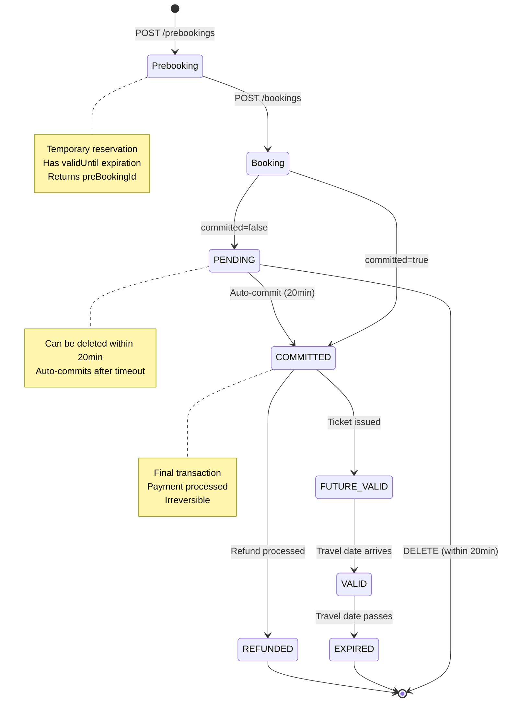

# SBB MCP Ecosystem: Architecture Comparison & Recommendations

**Date:** January 2026  
**Version:** 1.0  
**Authors:** Architecture Review Team

---

## Table of Contents

1. [Executive Summary](#executive-summary)
2. [Project Overview](#project-overview)
3. [Architectural Comparison](#architectural-comparison)
4. [Proposed Unified Architecture](#proposed-unified-architecture)
5. [Project-Specific Recommendations](#project-specific-recommendations)
6. [Implementation Priority](#implementation-priority)
7. [Appendix](#appendix)

---

## Executive Summary

The SBB MCP ecosystem consists of three interconnected projects that enable AI assistants to interact with Swiss public transport services:

| Project | Purpose | Tools | Protocol Version |
|---------|---------|-------|------------------|
| **journey-service-mcp** | Journey planning (read-heavy) | 13 | 2025-03-26 |
| **swiss-mobility-mcp** | Ticketing/booking (transactional) | 8 | 2024-11-05 |
| **sbb-mcp-commons** | Shared infrastructure library | N/A | N/A |

Both MCP servers are built with Spring Boot 3.x and WebFlux, sharing `sbb-mcp-commons` as their foundation. However, they have **fundamentally different architectural philosophies** driven by their distinct domains:

- **journey-service-mcp**: Optimized for exploration and discovery with stateful sessions, progress tracking, and SSE streaming
- **swiss-mobility-mcp**: Optimized for transactions with stateless design, safety prompts, and state-modifying flags

### Key Architectural Differences

| Aspect | journey-service-mcp | swiss-mobility-mcp |
|--------|--------------------|--------------------|
| Session Model | Stateful (explicit sessions) | Stateless (no sessions) |
| Controllers | Dual (root + /mcp) | Single (/mcp) |
| State-Modifying Tools | 0 tools | 4 tools (50%) |
| Streaming | SSE support | No SSE |
| Progress Tracking | Yes (ProgressTracker) | No |
| Tool Pattern | BaseToolHandler template | Direct McpTool implementation |
| Cache Strategy | Multi-level (24hr uniform) | Single-level (domain-driven TTLs) |

---

## Project Overview

### journey-service-mcp

**Domain:** Swiss public transport journey planning

**Key Characteristics:**
- Read-only operations (no state modification)
- Stateful session management
- Real-time progress tracking via SSE
- Dual controller pattern (Goose + Claude compatibility)
- 760+ tests with 85%+ coverage

**Technology Stack:**
- Java 21 with Spring Boot 3.4
- Spring WebFlux (reactive)
- Redis for caching and sessions
- Resilience4j for fault tolerance
- OAuth2 for SBB API authentication

### swiss-mobility-mcp

**Domain:** Swiss public transport ticketing and booking

**Key Characteristics:**
- Transactional operations (50% state-modifying tools)
- Stateless REST API design
- Safety prompts for payment operations
- Single controller with REST discovery
- 89 tests with comprehensive coverage

**Technology Stack:**
- Java 21 with Spring Boot 3.5
- Spring WebFlux (reactive)
- Redis for caching
- Resilience4j for fault tolerance
- OAuth2 for Swiss Mobility API authentication

### sbb-mcp-commons

**Domain:** Shared MCP infrastructure

**Key Components:**
- `McpTool` interface for tool implementation
- `McpToolRegistry` for auto-discovery
- `McpPromptHandler` for prompt management
- `McpResourceHandler` for resource management
- `McpSessionStore` for session persistence
- Validation utilities and error handling

---

## Architectural Comparison

### 1. MCP Controller Architecture

#### journey-service-mcp: Dual Controller with Handler Delegation

**Pattern Overview:**
```
Client Request
     ↓
RootMcpController (/) or McpController (/mcp)
     ↓
McpToolHandler / McpSessionHandler (delegation)
     ↓
McpToolRegistry.invokeTool()
```

**Real Example: McpToolHandler.java**

```java
@Component
public class McpToolHandler {
    
    private final McpToolRegistry toolRegistry;
    private final ObjectMapper objectMapper;
    private final McpToolInvocationLogger toolInvocationLogger;
    
    /**
     * Handles the tools/list request
     */
    public Mono<McpResponse> handleToolsList(McpRequest request) {
        List<Map<String, Object>> toolsResponse = toolRegistry.listTools().stream()
            .map(tool -> {
                try {
                    // Parse inputSchema JSON string into an object
                    Object schemaObject = objectMapper.readValue(tool.inputSchema(), Object.class);
                    return Map.<String, Object>of(
                        "name", tool.name(),
                        "summary", tool.summary(),
                        "description", tool.description(),
                        "inputSchema", schemaObject
                    );
                } catch (Exception e) {
                    log.error("Failed to parse inputSchema for tool {}: {}", 
                              tool.name(), e.getMessage());
                    // Fallback to string if parsing fails
                    return Map.<String, Object>of(
                        "name", tool.name(),
                        "summary", tool.summary(),
                        "description", tool.description(),
                        "inputSchema", tool.inputSchema()
                    );
                }
            })
            .toList();
        
        log.info("Listing {} tools", toolsResponse.size());
        return Mono.just(McpResponse.success(request.id(), Map.of("tools", toolsResponse)));
    }
    
    /**
     * Handles the tools/call request with context management
     */
    @SuppressWarnings("unchecked")
    public Mono<McpResponse> handleToolsCall(McpRequest request, String sessionId) {
        try {
            Map<String, Object> params = (Map<String, Object>) request.params();
            String toolName = (String) params.get("name");
            Map<String, Object> arguments = (Map<String, Object>) params.get("arguments");
            
            if (toolName == null || !toolRegistry.hasTool(toolName)) {
                return Mono.just(McpResponse.error(
                    request.id(),
                    McpResponse.McpError.invalidParams("Tool not found: " + toolName)
                ));
            }
            
            // Log tool invocation start
            String correlationId = String.valueOf(request.id());
            long startTime = System.currentTimeMillis();
            toolInvocationLogger.logToolInvocationStart(
                correlationId, toolName, arguments != null ? arguments : Map.of()
            );
            
            // Set request context for tools to access
            McpRequestContext.setSessionId(sessionId);
            McpRequestContext.setCorrelationId(correlationId);
            
            return toolRegistry.invokeTool(toolName, arguments != null ? arguments : Map.of())
                .map(result -> {
                    long duration = System.currentTimeMillis() - startTime;
                    
                    // Extract actual data from McpResult wrapper
                    Object actualData = result;
                    boolean isError = false;
                    
                    if (result instanceof ch.sbb.mcp.commons.core.McpResult) {
                        ch.sbb.mcp.commons.core.McpResult<?> mcpResult = 
                            (ch.sbb.mcp.commons.core.McpResult<?>) result;
                        
                        if (mcpResult.isSuccess()) {
                            if (mcpResult instanceof ch.sbb.mcp.commons.core.McpResult.Success) {
                                actualData = ((ch.sbb.mcp.commons.core.McpResult.Success<?>) mcpResult).data();
                            }
                        } else {
                            isError = true;
                            if (mcpResult instanceof ch.sbb.mcp.commons.core.McpResult.Failure) {
                                ch.sbb.mcp.commons.core.McpError error = 
                                    ((ch.sbb.mcp.commons.core.McpResult.Failure<?>) mcpResult).error();
                                actualData = Map.of(
                                    "error", error.message(),
                                    "details", error.details() != null ? error.details() : ""
                                );
                            }
                        }
                    }
                    
                    // Log success/failure
                    if (!isError) {
                        toolInvocationLogger.logToolInvocationSuccess(
                            correlationId, toolName, duration, null
                        );
                    }
                    
                    // Wrap result in MCP CallToolResult format
                    try {
                        String formattedText = objectMapper.writerWithDefaultPrettyPrinter()
                            .writeValueAsString(actualData);
                        
                        Map<String, Object> callToolResult = Map.of(
                            "content", List.of(Map.of(
                                "type", "text",
                                "text", formattedText
                            )),
                            "isError", isError
                        );
                        return McpResponse.success(request.id(), callToolResult);
                    } catch (Exception e) {
                        log.error("Failed to serialize tool result", e);
                        return McpResponse.error(
                            request.id(),
                            McpResponse.McpError.internalError("Result serialization failed")
                        );
                    }
                })
                .doFinally(signalType -> McpRequestContext.clear())
                .onErrorResume(e -> {
                    long duration = System.currentTimeMillis() - startTime;
                    toolInvocationLogger.logToolInvocationFailure(
                        correlationId, toolName, duration, e
                    );
                    McpRequestContext.clear();
                    return Mono.just(McpResponse.error(
                        request.id(),
                        McpResponse.McpError.internalError(e.getMessage())
                    ));
                });
                
        } catch (Exception e) {
            return Mono.just(McpResponse.error(
                request.id(),
                McpResponse.McpError.invalidParams("Invalid parameters: " + e.getMessage())
            ));
        }
    }
}
```

**Key Features:**
- ✅ **Handler delegation** for separation of concerns
- ✅ **Context management** (session ID, correlation ID)
- ✅ **Comprehensive logging** (start, success, failure)
- ✅ **McpResult unwrapping** with error handling
- ✅ **Resource cleanup** (doFinally)

---

#### swiss-mobility-mcp: Single Controller with Inline Routing

**Pattern Overview:**
```
Client Request
     ↓
RootMcpController (/mcp)
     ↓
Switch statement (inline routing)
     ↓
McpToolRegistry.invokeTool()
```

**Real Example: RootMcpController.java**

```java
@RestController
@RequestMapping("/mcp")
public class RootMcpController {

    private final McpToolRegistry toolRegistry;
    private final ObjectMapper objectMapper;
    private final List<McpPrompt> promptsList;

    @PostMapping(consumes = MediaType.APPLICATION_JSON_VALUE)
    public Mono<ResponseEntity<McpResponse>> handleMcpRequest(@RequestBody McpRequest request) {
        log.info("MCP request received: method={}, id={}", request.method(), request.id());

        return switch (request.method()) {
            case "initialize" -> handleInitialize(request);
            case "tools/list" -> handleToolsList(request);
            case "tools/call" -> handleToolsCall(request);
            case "resources/list" -> handleResourcesList(request);
            case "resources/read" -> handleResourcesRead(request);
            case "prompts/list" -> handlePromptsList(request);
            case "prompts/get" -> handlePromptsGet(request);
            default -> Mono.just(ResponseEntity.ok(McpResponse.error(
                request.id(),
                McpError.methodNotFound(request.method())
            )));
        };
    }

    private Mono<ResponseEntity<McpResponse>> handleToolsList(McpRequest request) {
        log.info("Tools list request received");

        var tools = toolRegistry.listTools().stream()
            .map(info -> Map.of(
                "name", info.name(),
                "description", info.description() != null ? info.description() : info.summary(),
                "inputSchema", parseJsonSchema(info.inputSchema())
            ))
            .toList();

        Map<String, Object> result = Map.of("tools", tools);
        return Mono.just(ResponseEntity.ok(McpResponse.success(request.id(), result)));
    }

    @SuppressWarnings("unchecked")
    private Mono<ResponseEntity<McpResponse>> handleToolsCall(McpRequest request) {
        Map<String, Object> params = (Map<String, Object>) request.params();
        String toolName = (String) params.get("name");
        Map<String, Object> arguments = (Map<String, Object>) params.get("arguments");

        log.info("Tool call request: tool={}", toolName);

        if (!toolRegistry.hasTool(toolName)) {
            return Mono.just(ResponseEntity.ok(McpResponse.error(
                request.id(),
                McpError.invalidRequest("Tool not found: " + toolName)
            )));
        }

        return toolRegistry.invokeTool(toolName, arguments != null ? arguments : Map.of())
            .map(output -> {
                // MCP expects a "content" list in the result
                Map<String, Object> result = Map.of(
                    "content", List.of(
                        Map.of(
                            "type", "text",
                            "text", output.toString()
                        )
                    )
                );
                return ResponseEntity.ok(McpResponse.success(request.id(), result));
            })
            .onErrorResume(e -> {
                log.error("Tool execution failed", e);
                return Mono.just(ResponseEntity.ok(McpResponse.error(
                    request.id(),
                    McpError.internalError("Tool execution failed: " + e.getMessage())
                )));
            });
    }

    private Object parseJsonSchema(String schema) {
        try {
            return objectMapper.readValue(schema, Object.class);
        } catch (Exception e) {
            log.warn("Failed to parse JSON schema: {}", e.getMessage());
            return Map.of("type", "object");
        }
    }
    
    // REST GET endpoints for easy discovery
    @GetMapping(value = "/tools", produces = MediaType.APPLICATION_JSON_VALUE)
    public Mono<Map<String, Object>> listToolsRest() {
        log.debug("REST: Listing MCP tools");
        McpRequest request = new McpRequest("2.0", "rest", "tools/list", Map.of());
        return handleToolsList(request)
            .map(ResponseEntity::getBody)
            .cast(McpResponse.class)
            .map(response -> {
                if (response.result() instanceof Map) {
                    return (Map<String, Object>) response.result();
                }
                return Map.<String, Object>of("tools", List.of());
            });
    }
}
```

**Key Features:**
- ✅ **Simple switch routing** (easy to understand)
- ✅ **Inline error handling** (no abstraction overhead)
- ✅ **REST discovery endpoints** (GET /mcp/tools, /resources, /prompts)
- ✅ **Direct tool invocation** (minimal layers)
- ❌ **No context management** (stateless)
- ❌ **No structured logging** (basic log statements)

---

#### Comparison

| Aspect | journey-service-mcp | swiss-mobility-mcp |
|--------|--------------------|--------------------|
| **Controllers** | 2 (RootMcpController + McpController) | 1 (RootMcpController) |
| **Handler Classes** | McpToolHandler, McpSessionHandler | None (inline) |
| **Context Management** | McpRequestContext (session, correlation) | None |
| **Logging** | Structured (McpToolInvocationLogger) | Basic (log statements) |
| **Error Handling** | McpResult unwrapping | Direct exceptions |
| **REST Endpoints** | Yes (/mcp/tools, /resources, /prompts) | Yes (same) |
| **Lines of Code** | ~200 (McpToolHandler) | ~100 (inline in controller) |

**Verdict:** 
- **journey-service-mcp** is better for **complex, stateful systems** requiring context tracking and detailed observability
- **swiss-mobility-mcp** is better for **simple, stateless APIs** where simplicity and directness are priorities

---

### 2. Session Management

#### journey-service-mcp: Stateful Sessions

```java
// Session lifecycle
McpSessionHandler.createSession()     // On initialize
McpSessionHandler.validateSession()   // Every request
McpSessionHandler.touchSession()      // Extends TTL
McpSessionHandler.terminateSession()  // On DELETE

// Storage options
McpSessionStore (interface from commons)
├── InMemoryMcpSessionStore (dev)
└── RedisMcpSessionStore (prod)
```

**Benefits:**
- Tracks conversation state across requests
- Enables progress notifications per session
- Supports session-scoped caching
- Correlates logs across multi-turn interactions

#### swiss-mobility-mcp: Stateless Server, Stateful Domain

**Server Architecture:**
- No session management (no `McpSessionStore`)
- Each API request is independent
- Simpler deployment (no session affinity needed)
- Horizontal scaling without coordination

**Domain Model (Highly Stateful):**

While the MCP server itself is stateless, the **booking domain is inherently stateful** with a multi-step lifecycle:



**Booking States:**

1. **Prebooking** (`PrebookingResponse`)
   - Temporary reservation with `preBookingId`
   - Has `validUntil` expiration timestamp
   - Required before final booking

2. **Booking Transaction States** (`BookingData.status`)
   - `PENDING`: Can be deleted within 20 minutes
   - `COMMITTED`: Final, irreversible transaction

3. **Ticket Lifecycle States** (`BookingDataItem.status`)
   - `ZUKUNFT_GUELTIG`: Future valid (before travel date)
   - `GUELTIG`: Currently valid (on travel date)
   - `ABGELAUFEN`: Expired (after travel date)
   - `RUECKERSTATTET`: Refunded

**Verdict:** The MCP server is **stateless** (no session management), but the **booking domain is stateful** (multi-step lifecycle with state transitions). This is fundamentally different from journey-service-mcp, where both the server AND domain benefit from stateful sessions for multi-turn exploration.

---

### 3. Tool Implementation Patterns

#### journey-service-mcp: Inline Implementation with Progress Tracking

**Real Example: FindTripsTool.java (552 lines)**

```java
@Component
public class FindTripsTool implements McpTool<McpResult<JsonNode>> {
    
    private static final String NAME = "findTrips";
    private static final String SUMMARY = "Find trips between origin and destination";
    
    private final SbbApiClient sbbApiClient;
    private final JourneyService journeyService;
    private final ObjectMapper objectMapper;
    private final McpSearchCacheService searchCache;
    private final ProgressNotificationService progressService;
    
    @Override
    public Mono<McpResult<JsonNode>> invoke(Map<String, Object> arguments) {
        // 1. VALIDATION: Extract and validate arguments
        String originName = (String) arguments.get("origin");
        String destinationName = (String) arguments.get("destination");
        if (originName == null || originName.isBlank() || 
            destinationName == null || destinationName.isBlank()) {
            return Mono.just(McpResult.invalidInput(
                "Origin and destination are required", 
                "The parameters must be non-empty strings"
            ));
        }
        
        // 2. APPLY RESPONSE MODE: Configure based on user preference
        String responseMode = (String) arguments.get("responseMode");
        ResponseModeConfig modeConfig = ResponseModeConfig.fromMode(responseMode);
        
        int duration = arguments.containsKey("duration") 
            ? ArgumentExtractor.extractInt(arguments, "duration", DEFAULT_DURATION)
            : modeConfig.duration();
        int limit = arguments.containsKey("limit")
            ? ArgumentExtractor.extractInt(arguments, "limit", DEFAULT_LIMIT)
            : modeConfig.limit();
        
        // 3. PROGRESS TRACKING: Initialize 4-step tracker
        String sessionId = McpRequestContext.getSessionId().orElse(null);
        ProgressTracker progress = sessionId != null 
            ? progressService.createTracker(sessionId, NAME, 4)
            : null;

        // 4. PARALLEL RESOLUTION: Resolve both places concurrently
        return Mono.zip(
            resolveToUic(originName, language)
                .doOnSuccess(uic -> {
                    if (progress != null) progress.step("Resolved origin: " + originName);
                }),
            resolveToUic(destinationName, language)
                .doOnSuccess(uic -> {
                    if (progress != null) progress.step("Resolved destination: " + destinationName);
                })
        )
        .flatMap(tuple -> {
            String originUic = tuple.getT1();
            String destinationUic = tuple.getT2();
            
            // 5. API CALL: Build request and fetch data
            SbbTripsIntervalsRequest request = new SbbTripsIntervalsRequest(
                originUic, destinationUic, date, time, duration, 
                pagingCursor, limit, includeIntermediateStops, 
                transportModes, "REALTIME", false, 
                includeAccessibility, minimumTransferTime, includeTrainFormation
            );
            
            if (progress != null) progress.step("Fetching journey data from SBB API");
            
            return sbbApiClient.getTripIntervals(request, language)
                .map(response -> {
                    if (progress != null) progress.step("Processing journey results");
                    
                    // 6. POST-PROCESSING: Strip notices in compact mode
                    var processedTrips = response.trips();
                    if (!shouldIncludeNotices && processedTrips != null) {
                        processedTrips = stripNoticesFromTrips(processedTrips);
                    }
                    
                    // 7. BUILD RESPONSE: Create structured result
                    ObjectNode result = objectMapper.createObjectNode();
                    result.put("origin", originName);
                    result.put("destination", destinationName);
                    result.put("totalResults", processedTrips != null ? processedTrips.size() : 0);
                    result.set("summary", buildSummary(processedTrips, originName, destinationName));
                    result.set("trips", objectMapper.valueToTree(processedTrips));
                    
                    // 8. SIZE CHECK: Truncate if needed
                    result = truncateResponseIfNeeded(result, response.trips());
                    
                    if (progress != null) progress.complete();
                    return McpResult.success((JsonNode) result);
                });
        })
        .onErrorResume(error -> {
            if (progress != null) progress.complete();
            if (error instanceof IllegalArgumentException) 
                return Mono.just(McpResult.invalidInput("Place not found", error.getMessage()));
            return Mono.just(McpResult.failure(
                McpError.externalApiError("Failed to get trip intervals", error.getMessage())
            ));
        });
    }
    
    /**
     * Resolve place name to UIC code with caching
     */
    private Mono<String> resolveToUic(String nameOrUic, String language) {
        // If already a UIC code, return directly
        if (nameOrUic.trim().matches("\\d+")) {
            return Mono.just(nameOrUic.trim());
        }
        
        // Check cache first
        return Mono.fromCallable(() -> searchCache.getCachedUic(nameOrUic))
            .flatMap(cachedUic -> {
                if (cachedUic.isPresent()) {
                    logger.debug("Using cached UIC for '{}': {}", nameOrUic, cachedUic.get());
                    return Mono.just(cachedUic.get());
                }
                
                // Cache miss - query API
                return sbbApiClient.findPlaces(nameOrUic, List.of("StopPlace"), 1, 
                                               null, null, null, null, language)
                    .flatMapMany(response -> Flux.fromIterable(response.places()))
                    .filter(p -> "StopPlace".equals(p.type()))
                    .next()
                    .map(p -> p.id())
                    .doOnNext(uic -> searchCache.cacheUic(nameOrUic, uic))
                    .switchIfEmpty(Mono.error(new IllegalArgumentException(
                        "Place '" + nameOrUic + "' not found"
                    )));
            });
    }
}
```

**Key Features:**
- ✅ **Inline validation** with descriptive error messages
- ✅ **Progress tracking** (4 steps: origin, destination, API, processing)
- ✅ **Caching** for place name resolution
- ✅ **Response optimization** (compact/standard/detailed modes)
- ✅ **Size management** (truncation at 200KB)
- ✅ **McpResult wrapper** for standardized error handling
- ❌ **No state-modifying flag** (missing safety feature)

---

#### swiss-mobility-mcp: Direct Implementation with Safety Flag

**Real Example: GetTripPricingTool.java (190 lines)**

```java
@Component
public class GetTripPricingTool implements McpTool<JsonNode> {

    private static final Logger logger = LoggerFactory.getLogger(GetTripPricingTool.class);
    
    private static final String NAME = "getTripPricing";
    private static final String SUMMARY = "Calculate ticket pricing for a journey";
    private static final String DESCRIPTION = """
        Calculate ticket pricing for a Swiss public transport journey.

        **What you'll get**:
        - Price per passenger (in centimes, e.g., 2200 = CHF 22.00)
        - Product information
        - SuperSaver indicator

        **Note**: Requires tripId from journey-service-mcp's findTrips tool.
        Results are cached for 5 minutes.

        **Reduction codes**: none, half-fare, ga-1st, ga-2nd, junior-card
        """;

    private final PricingService pricingService;
    private final ObjectMapper objectMapper;

    @Override
    public Mono<JsonNode> invoke(Map<String, Object> arguments) {
        // 1. VALIDATION: Extract and validate required fields
        String tripId = (String) arguments.get("tripId");
        if (tripId == null || tripId.isBlank()) {
            throw new IllegalArgumentException("tripId is required");
        }

        @SuppressWarnings("unchecked")
        List<Map<String, Object>> passengerMaps = 
            (List<Map<String, Object>>) arguments.get("passengers");
        if (passengerMaps == null || passengerMaps.isEmpty()) {
            throw new IllegalArgumentException("At least one passenger is required");
        }

        // 2. EXTRACT OPTIONAL PARAMETERS with defaults
        Integer travelClass = arguments.containsKey("travelClass")
            ? ((Number) arguments.get("travelClass")).intValue()
            : TripPricesRequest.SECOND_CLASS;

        Integer productId = arguments.containsKey("productId")
            ? ((Number) arguments.get("productId")).intValue()
            : null;

        // 3. TRANSFORM PASSENGERS: Convert to API format "id;age;reduction"
        List<String> passengers = new ArrayList<>();
        for (Map<String, Object> passengerMap : passengerMaps) {
            String id = (String) passengerMap.get("id");
            Integer age = ((Number) passengerMap.get("age")).intValue();
            String reduction = (String) passengerMap.getOrDefault(
                "reduction", TripPricesRequest.REDUCTION_NONE
            );

            passengers.add(TripPricesRequest.formatPassenger(id, age, reduction));
        }

        // 4. BUILD REQUEST: Create pricing request
        TripPricesRequest request = TripPricesRequest.builder()
            .tripId(tripId)
            .passengers(passengers)
            .qualityOfService(travelClass)
            .productId(productId)
            .build();

        logger.info("Calculating pricing for trip {} with {} passengers (class {})",
            tripId, passengers.size(), travelClass);

        // 5. EXECUTE: Call pricing service (cached for 5 minutes)
        return pricingService.calculatePricing(request)
            .map(prices -> {
                JsonNode result = objectMapper.valueToTree(prices);
                if (!prices.isEmpty()) {
                    logger.info("Pricing calculated: {} prices returned, first: {}",
                        prices.size(), prices.get(0).getFormattedPrice());
                }
                return result;
            });
    }

    @Override
    public boolean isStateModifying() {
        return false;  // Read-only operation
    }
}
```

**Key Features:**
- ✅ **Simple validation** with exceptions
- ✅ **Direct service delegation** (no intermediate layers)
- ✅ **State-modifying flag** for LLM safety
- ✅ **Structured logging** for observability
- ✅ **Automatic caching** (5 min TTL via @Cacheable in service)
- ❌ **No progress tracking** (not needed for fast operations)
- ❌ **No McpResult wrapper** (uses exceptions for errors)

---

#### swiss-mobility-mcp: Two-Step Booking Flow (Stateful Domain)

**Real Example: CreateBookingTool.java (215 lines)**

The booking flow demonstrates the **stateful nature** of the ticketing domain, even though the MCP server itself is stateless:

```java
@Component
public class CreateBookingTool implements McpTool<JsonNode> {
    
    private static final String NAME = "createBooking";
    private static final String SUMMARY = "Create a confirmed booking with payment";
    
    private final BookingService bookingService;
    private final ObjectMapper objectMapper;
    
    /**
     * Implements the two-step booking flow required by Swiss Mobility API:
     * 1. Prebooking: Reserve the offer (creates temporary state)
     * 2. Booking: Confirm with payment (transitions to final state)
     */
    @Override
    public Mono<JsonNode> invoke(Map<String, Object> arguments) {
        // 1. VALIDATION: Extract offer ID and passenger details
        String offerId = (String) arguments.get("offerId");
        if (offerId == null || offerId.isBlank()) {
            throw new IllegalArgumentException("offerId is required");
        }
        
        @SuppressWarnings("unchecked")
        List<Map<String, Object>> passengerMaps = 
            (List<Map<String, Object>>) arguments.get("passengers");
        if (passengerMaps == null || passengerMaps.isEmpty()) {
            throw new IllegalArgumentException("At least one passenger is required");
        }
        
        // 2. TRANSFORM PASSENGERS: Convert to API format
        List<PrebookingRequest.PassengerDetails> passengers = new ArrayList<>();
        for (Map<String, Object> passengerMap : passengerMaps) {
            String id = (String) passengerMap.get("id");
            String firstname = (String) passengerMap.get("firstname");
            String lastname = (String) passengerMap.get("lastname");
            String dateOfBirth = (String) passengerMap.get("dateOfBirth");
            String email = (String) passengerMap.get("email");
            String phone = (String) passengerMap.get("phone");
            
            validatePassenger(id, firstname, lastname);
            passengers.add(new PrebookingRequest.PassengerDetails(
                id, firstname, lastname, dateOfBirth, email, phone
            ));
        }
        
        // 3. COMMITTED FLAG: Determines final state (PENDING vs COMMITTED)
        boolean committed = (Boolean) arguments.getOrDefault("committed", true);
        
        // 4. BUILD REQUEST: Create prebooking request
        PrebookingRequest prebookingRequest = new PrebookingRequest(offerId, passengers);
        
        logger.warn("Creating REAL booking for offer: {} with {} passengers (committed: {})",
            offerId, passengers.size(), committed);
        
        // 5. TWO-STEP FLOW: Prebooking → Booking (state transitions)
        return bookingService.createPrebooking(prebookingRequest)
            .flatMap(prebooking -> {
                // STATE: Prebooking created (temporary reservation)
                logger.info("Prebooking created: {}, proceeding to final booking", 
                           prebooking.preBookingId());
                
                // STATE TRANSITION: Prebooking → PENDING/COMMITTED
                return bookingService.createBooking(prebooking.preBookingId(), committed);
            })
            .map(booking -> {
                // STATE: Booking confirmed (PENDING or COMMITTED)
                JsonNode result = objectMapper.valueToTree(booking);
                logger.info("Booking created successfully: {} with {} tickets (status: {})",
                    booking.bookingId(),
                    booking.tickets() != null ? booking.tickets().size() : 0,
                    booking.status());
                return result;
            });
    }
    
    @Override
    public boolean isStateModifying() {
        return true;  // Creates financial transactions
    }
}
```

**State Transitions in Code:**

```java
// STEP 1: Create Prebooking (temporary reservation)
// API: POST /api/v2/prebookings
PrebookingResponse prebooking = bookingService.createPrebooking(request);
// Returns: { preBookingId, validUntil, totalPrice, ... }

// STEP 2: Confirm Booking (state transition)
// API: POST /api/v2/bookings
BookingResponse booking = bookingService.createBooking(
    prebooking.preBookingId(), 
    committed  // true → COMMITTED, false → PENDING
);
// Returns: { bookingId, status: "PENDING" | "COMMITTED", tickets: [...] }

// STEP 3: Ticket Lifecycle (automatic state transitions)
// Ticket states transition automatically based on travel date:
// COMMITTED → FUTURE_VALID → VALID → EXPIRED
// Or manually via refund: COMMITTED → REFUNDED
```

**Domain State Models:**

```java
// Prebooking state (temporary)
public record PrebookingResponse(
    String preBookingId,      // Required for next step
    String offerId,
    Integer totalPrice,
    String validUntil,        // Expiration timestamp
    List<PrebookedPassenger> passengers
) {}

// Booking transaction state
public record BookingData(
    String bookingId,
    String status,            // "PENDING" | "COMMITTED"
    List<BookingDataItem> bookings
) {
    public static final String STATUS_PENDING = "PENDING";
    public static final String STATUS_COMMITTED = "COMMITTED";
}

// Ticket lifecycle state
public record BookingDataItem(
    String ticketId,
    String status,            // Ticket lifecycle state
    Integer price,
    String travelDate,
    RefundData refundData     // Present if REFUNDED
) {
    public static final String STATUS_FUTURE_VALID = "ZUKUNFT_GUELTIG";
    public static final String STATUS_VALID = "GUELTIG";
    public static final String STATUS_EXPIRED = "ABGELAUFEN";
    public static final String STATUS_REFUNDED = "RUECKERSTATTET";
}
```

**Key Features:**
- ✅ **Two-step flow** (prebooking → booking) with explicit state transitions
- ✅ **State-modifying flag** for LLM safety
- ✅ **Committed flag** controls final state (PENDING vs COMMITTED)
- ✅ **Ticket lifecycle** with automatic state transitions
- ✅ **Refund support** (COMMITTED → REFUNDED transition)
- ✅ **Time-based constraints** (20-minute deletion window for PENDING)
- ❌ **No progress tracking** (operations are fast, <1 second)
- ❌ **No session management** (server is stateless, domain is stateful)

---

#### Comparison Table

| Aspect | journey-service-mcp | swiss-mobility-mcp |
|--------|--------------------|---------------------|
| **Lines of Code** | 552 (FindTripsTool) | 215 (CreateBookingTool) |
| **Validation** | Inline with McpResult | Exception-based |
| **Progress Tracking** | 4-step tracker | None |
| **Caching** | Custom (McpSearchCacheService) | Spring @Cacheable |
| **Error Handling** | McpResult.invalidInput() | IllegalArgumentException |
| **Response Type** | McpResult<JsonNode> | JsonNode |
| **State-Modifying Flag** | ❌ Missing | ✅ Present (4/8 tools) |
| **Response Optimization** | 3 modes (compact/standard/detailed) | Single mode |
| **Size Management** | Truncation at 200KB | No limit |
| **Domain Statefulness** | Read-only (no state) | Multi-step flow (prebooking → booking) |
| **State Transitions** | None | 3 levels (prebooking, booking, ticket) |
| **Time Constraints** | None | 20-min deletion window (PENDING) |

---

#### Verdict

**journey-service-mcp strengths:**
- Better for **complex, multi-step operations**
- **Progress tracking** improves UX for long operations
- **Response optimization** reduces bandwidth
- **Size management** prevents oversized responses

**swiss-mobility-mcp strengths:**
- **Simpler code** for straightforward operations
- **State-modifying flag** critical for safety (4/8 tools modify state)
- **Exception-based** validation is more idiomatic
- **Cleaner separation** of concerns (caching in service layer)
- **Stateful domain model** with explicit state transitions
- **Two-step booking flow** ensures safety (prebooking → booking)
- **Time-based constraints** (20-min deletion window) prevent accidental charges

**Key Architectural Insight:**

The fundamental difference is **where state lives**:

| Aspect | journey-service-mcp | swiss-mobility-mcp |
|--------|--------------------|--------------------|  
| **Server State** | ✅ Stateful (sessions) | ❌ Stateless |
| **Domain State** | ❌ Stateless (read-only) | ✅ Stateful (lifecycle) |
| **State Storage** | Redis (sessions) | External API (Swiss Mobility) |
| **State Purpose** | Multi-turn conversation | Business transactions |
| **State Lifetime** | 1 hour (session TTL) | Days/months (ticket validity) |

**Recommended hybrid approach:**
- Use **swiss-mobility-mcp's simplicity** for basic tools
- Add **progress tracking** for operations >1 second
- **Always include** `isStateModifying()` flag for state-modifying operations
- Use **McpResult** for complex error scenarios
- Implement **response modes** for large datasets
- For **stateful domains**, model state explicitly (like `PrebookingResponse`, `BookingData`)
- For **stateful servers**, use session management (like `McpSessionStore`)
- **Don't confuse the two**: A stateless server can have a stateful domain, and vice versa

---

### 4. Caching Strategy

#### journey-service-mcp: Infrastructure-Driven TTLs

**Real Example: CacheConfig.java**

```java
@Configuration
@EnableCaching
@ConditionalOnBean(RedisConnectionFactory.class)
public class CacheConfig {
    
    // Cache TTL constants
    private static final Duration TTL_SERVICE_CALENDAR = Duration.ofDays(7);
    private static final Duration TTL_STOP_PLACES = Duration.ofHours(24);
    private static final Duration TTL_CO2_FACTORS = Duration.ofDays(30);
    private static final Duration TTL_SERVICE_INFO = Duration.ofHours(1);
    private static final Duration TTL_DEFAULT = Duration.ofHours(24);
    
    @Bean
    public CacheManager cacheManager(RedisConnectionFactory connectionFactory) {
        // Default cache configuration
        RedisCacheConfiguration defaultConfig = RedisCacheConfiguration.defaultCacheConfig()
                .entryTtl(TTL_DEFAULT)
                .serializeKeysWith(
                        RedisSerializationContext.SerializationPair.fromSerializer(
                            new StringRedisSerializer()
                        )
                )
                .serializeValuesWith(
                        RedisSerializationContext.SerializationPair.fromSerializer(
                                new GenericJackson2JsonRedisSerializer()
                        )
                )
                .disableCachingNullValues()
                .prefixCacheNameWith("cache::");
        
        // Custom TTLs for specific caches
        Map<String, RedisCacheConfiguration> cacheConfigurations = new HashMap<>();
        
        // Service Calendar: 7 days (changes only during timetable changes)
        cacheConfigurations.put("serviceCalendar", 
                defaultConfig.entryTtl(TTL_SERVICE_CALENDAR));
        
        // Stop Places: 24 hours (station metadata is relatively stable)
        cacheConfigurations.put("stopPlaces", 
                defaultConfig.entryTtl(TTL_STOP_PLACES));
        
        // CO2 Factors: 30 days (static reference data)
        cacheConfigurations.put("co2Factors", 
                defaultConfig.entryTtl(TTL_CO2_FACTORS));
        
        // Service info: 1 hour (about, health endpoints)
        cacheConfigurations.put("about", 
                defaultConfig.entryTtl(TTL_SERVICE_INFO));
        cacheConfigurations.put("health", 
                defaultConfig.entryTtl(TTL_SERVICE_INFO));
        
        return RedisCacheManager.builder(connectionFactory)
                .cacheDefaults(defaultConfig)
                .withInitialCacheConfigurations(cacheConfigurations)
                .transactionAware()
                .build();
    }
}
```

**TTL Rationale:**
- **7 days** (serviceCalendar): Changes only 2x/year during Fahrplanwechsel
- **24 hours** (stopPlaces): Station metadata is stable
- **30 days** (co2Factors): Static reference data
- **1 hour** (about/health): Service metadata

---

#### swiss-mobility-mcp: Domain-Driven TTLs

**Real Example: CacheConfig.java**

```java
@Configuration
@EnableCaching
@ConditionalOnBean(RedisConnectionFactory.class)
public class CacheConfig {

    // Cache TTL constants - optimized for Swiss Mobility API
    private static final Duration TTL_PRICING = Duration.ofMinutes(5);
    private static final Duration TTL_BOOKINGS = Duration.ofHours(1);
    private static final Duration TTL_PRODUCT_OFFERS = Duration.ofMinutes(30);
    private static final Duration TTL_SERVICE_INFO = Duration.ofHours(1);
    private static final Duration TTL_DEFAULT = Duration.ofHours(1);

    @Bean
    public CacheManager cacheManager(RedisConnectionFactory connectionFactory) {
        // Default cache configuration
        RedisCacheConfiguration defaultConfig = RedisCacheConfiguration.defaultCacheConfig()
                .entryTtl(TTL_DEFAULT)
                .serializeKeysWith(
                        RedisSerializationContext.SerializationPair.fromSerializer(
                            new StringRedisSerializer()
                        )
                )
                .serializeValuesWith(
                        RedisSerializationContext.SerializationPair.fromSerializer(
                                new GenericJackson2JsonRedisSerializer()
                        )
                )
                .disableCachingNullValues()
                .prefixCacheNameWith("swiss-mobility::");

        // Custom TTLs for specific caches
        Map<String, RedisCacheConfiguration> cacheConfigurations = new HashMap<>();

        // Pricing: 5 minutes (Look2Book ratio mitigation)
        cacheConfigurations.put("pricing",
                defaultConfig.entryTtl(TTL_PRICING));

        // Bookings: 1 hour (user session duration)
        cacheConfigurations.put("bookings",
                defaultConfig.entryTtl(TTL_BOOKINGS));

        // Product offers: 30 minutes (offer validity)
        cacheConfigurations.put("productOffers",
                defaultConfig.entryTtl(TTL_PRODUCT_OFFERS));

        // Service info: 1 hour (about, health endpoints)
        cacheConfigurations.put("about",
                defaultConfig.entryTtl(TTL_SERVICE_INFO));
        cacheConfigurations.put("health",
                defaultConfig.entryTtl(TTL_SERVICE_INFO));

        return RedisCacheManager.builder(connectionFactory)
                .cacheDefaults(defaultConfig)
                .withInitialCacheConfigurations(cacheConfigurations)
                .transactionAware()
                .build();
    }
}
```

**TTL Rationale (Business-Driven):**
- **5 minutes** (pricing): **Look2Book ratio mitigation** - prevents excessive pricing API calls
- **1 hour** (bookings): **User session duration** - typical booking session length
- **30 minutes** (productOffers): **Offer validity period** - how long offers remain valid
- **1 hour** (about/health): Service metadata

---

#### Comparison

| Cache | journey-service-mcp TTL | swiss-mobility-mcp TTL | Driver |
|-------|------------------------|------------------------|--------|
| **Pricing** | N/A | **5 min** | Business constraint (Look2Book) |
| **Bookings** | N/A | **1 hour** | User behavior (session) |
| **Offers** | N/A | **30 min** | Business rule (validity) |
| **Stations** | **24 hours** | N/A | Data volatility (stable) |
| **Calendar** | **7 days** | N/A | Update frequency (2x/year) |
| **CO2 Factors** | **30 days** | N/A | Data nature (static) |
| **Default** | **24 hours** | **1 hour** | Conservative vs. Fresh |

**Key Insight:** 
- **journey-service-mcp** uses **infrastructure-driven TTLs** (how often data changes)
- **swiss-mobility-mcp** uses **state-driven TTLs** (aligned with booking lifecycle states)
  - **5 min** (pricing): Offer state expires quickly (Look2Book optimization)
  - **1 hour** (bookings): Aligns with PENDING state deletion window (20 min) + buffer
  - **30 min** (offers): Matches prebooking `validUntil` expiration

**Verdict:** swiss-mobility-mcp's **state-driven approach** is more maintainable because TTLs are tied to domain state transitions, making them easier to justify and adjust as business rules change.

---

### 5. Prompts & LLM Guidance

#### swiss-mobility-mcp: Safety-First Approach

**Key Innovation - Safety Prompt:**

```java
new McpPrompt(
    "payment-safety-reminder",
    "Critical safety guidance for payment operations",
    List.of(),
    """
    CRITICAL PAYMENT SAFETY RULES:
    1. NEVER auto-proceed with bookings
    2. ALWAYS get explicit user confirmation
    3. NEVER handle raw card data
    4. ALWAYS display full cost breakdown
    5. ALWAYS provide cancellation information
    """
)
```

**Verdict:** swiss-mobility-mcp's safety prompts are a best practice that should be standardized across all state-modifying operations.

---

## Proposed Unified Architecture

### 1. Tool Implementation: Hybrid Approach

```java
public abstract class BaseMcpTool<I, O> implements McpTool<McpResult<O>> {
    // From journey-service-mcp: structured validation
    protected abstract I validateAndParse(Map<String, Object> args);
    protected abstract Mono<O> executeInternal(I input);

    // From swiss-mobility-mcp: state-modifying flag
    public boolean isStateModifying() { return false; }

    // Template method with standard error handling
    @Override
    public final Mono<McpResult<O>> invoke(Map<String, Object> args) {
        return Mono.fromCallable(() -> validateAndParse(args))
            .flatMap(this::executeInternal)
            .map(McpResult::success)
            .onErrorResume(this::handleError);
    }
}
```

### 2. Session Management: Configurable

```yaml
mcp:
  session:
    enabled: true/false  # true for journey, false for booking
    store: redis/memory
    ttl: PT1H
```

### 3. Caching: Domain-Driven TTLs

```java
@Configuration
public class CacheConfig {
    @Bean
    public Map<String, RedisCacheConfiguration> cacheConfigurations() {
        return Map.of(
            "journeys", config.entryTtl(Duration.ofMinutes(5)),
            "stations", config.entryTtl(Duration.ofHours(24)),
            "pricing", config.entryTtl(Duration.ofMinutes(5)),
            "bookings", config.entryTtl(Duration.ofHours(1))
        );
    }
}
```

### 4. Safety Prompts: Mandatory for State-Modifying Tools

```java
if (tools.stream().anyMatch(McpTool::isStateModifying)) {
    prompts.add(SafetyPromptBuilder.buildPaymentSafetyPrompt());
}
```

---

## Project-Specific Recommendations

### journey-service-mcp Recommendations

#### High Priority

| # | Recommendation | Effort | Impact | Files |
|---|----------------|--------|--------|-------|
| 1 | Add `isStateModifying()` to all tools | Low | High | All 13 tools |
| 2 | Add domain-driven cache TTLs | Low | Medium | RedisConfig.java |
| 3 | Add separate Redis circuit breaker | Low | Medium | ResilienceConfig.java |

#### Implementation: Domain-Driven Cache TTLs

```java
// Update RedisConfig.java
private Map<String, RedisCacheConfiguration> cacheConfigurations() {
    return Map.of(
        "trips", defaultConfig.entryTtl(Duration.ofMinutes(5)),      // Fresh for planning
        "stations", defaultConfig.entryTtl(Duration.ofHours(24)),    // Static reference
        "disruptions", defaultConfig.entryTtl(Duration.ofMinutes(2)), // Real-time
        "formations", defaultConfig.entryTtl(Duration.ofMinutes(15)) // Changes infrequently
    );
}
```

---

### swiss-mobility-mcp Recommendations

#### High Priority

| # | Recommendation | Effort | Impact |
|---|----------------|--------|--------|
| 1 | Add handler abstraction layer | Medium | High |
| 2 | Add BaseMcpTool template | Medium | High |
| 3 | Update to protocol version 2025-03-26 | Low | Medium |

#### Implementation: Handler Abstraction

```java
// Create controllers/handlers/McpToolHandler.java
@Component
public class McpToolHandler {
    private final McpToolRegistry toolRegistry;

    public Mono<ResponseEntity<McpResponse>> handleToolsList(McpRequest request) {
        var tools = toolRegistry.listTools().stream()
            .map(info -> Map.of(
                "name", info.name(),
                "description", info.description(),
                "inputSchema", parseJsonSchema(info.inputSchema())
            ))
            .toList();
        return Mono.just(ResponseEntity.ok(
            McpResponse.success(request.id(), Map.of("tools", tools))
        ));
    }

    public Mono<ResponseEntity<McpResponse>> handleToolsCall(McpRequest request) {
        // Extract tool invocation logic from RootMcpController
    }
}
```

---

### sbb-mcp-commons Recommendations

#### High Priority

| # | Recommendation | Effort | Impact |
|---|----------------|--------|--------|
| 1 | Add `isStateModifying()` to McpTool interface | Low | High |
| 2 | Add BaseMcpTool abstract class | Medium | High |
| 3 | Add SafetyPromptBuilder | Low | Medium |

#### Implementation: McpTool Interface Enhancement

```java
// Update core/McpTool.java
public interface McpTool<T> {
    String name();
    String summary();
    String description();
    String inputSchema();
    Mono<T> invoke(Map<String, Object> arguments);

    // Add default method for backwards compatibility
    default boolean isStateModifying() {
        return false;
    }
}
```

---

## Implementation Priority

### Phase 1: Foundation (Week 1-2)

| Project | Task | Effort |
|---------|------|--------|
| commons | Add `isStateModifying()` to McpTool | Low |
| commons | Add BaseMcpTool abstract class | Medium |
| swiss-mobility | Add handler abstraction | Medium |
| journey | Add state-modifying flag to tools | Low |

### Phase 2: Consistency (Week 3-4)

| Project | Task | Effort |
|---------|------|--------|
| commons | Add SafetyPromptBuilder | Low |
| swiss-mobility | Update protocol version | Low |
| journey | Add domain-driven cache TTLs | Low |

### Phase 3: Enhancement (Week 5-6)

| Project | Task | Effort |
|---------|------|--------|
| swiss-mobility | Add BaseMcpTool usage | Medium |
| journey | Add Redis circuit breaker | Low |
| all | Documentation updates | Medium |

---

## Appendix

### A. Summary Recommendations

**Key Architectural Principle:**

Don't confuse **stateful servers** with **stateful domains**:
- **journey-service-mcp**: Stateful server (sessions) + Stateless domain (read-only queries)
- **swiss-mobility-mcp**: Stateless server + Stateful domain (booking lifecycle with state transitions)

Both approaches are valid; choose based on your use case:
- Use **stateful servers** for multi-turn conversations and exploration
- Use **stateful domains** for business transactions with explicit state transitions

**Adopt from journey-service-mcp:**
- Dual controller pattern for client compatibility
- Handler abstraction for maintainability
- BaseToolHandler template for consistency
- Progress tracking for long operations (>1 second)
- Session management for multi-turn exploration

**Adopt from swiss-mobility-mcp:**
- `isStateModifying()` flag for safety (critical for LLM guidance)
- State-driven cache TTLs (aligned with domain lifecycle)
- Safety prompts for state-modifying operations
- Separate circuit breakers per dependency
- Explicit state models (like `PrebookingResponse`, `BookingData`)
- Two-step flows for critical operations (prebooking → booking)
- Time-based constraints (20-min deletion window for PENDING)

**Standardize in sbb-mcp-commons:**
- BaseMcpTool abstract class
- SafetyPromptBuilder utility
- Progress tracking infrastructure
- Enhanced ArgumentExtractor
- State lifecycle documentation patterns

---

*This document is maintained in the swiss-mobility-mcp repository and should be updated when significant architectural changes are made to any project in the ecosystem.*
