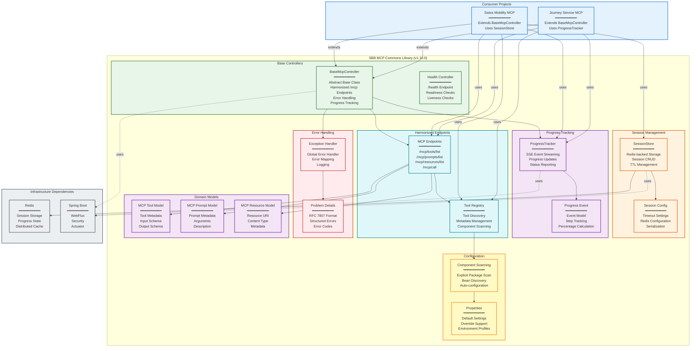

# SBB MCP Commons - Component Diagram

This document provides a detailed component diagram for the SBB MCP Commons shared library architecture.

## System Components



## Component Details

### Base Controllers

#### BaseMcpController

Abstract base class providing standardized MCP server functionality:

- **Harmonized Endpoints**: Implements `/mcp/*` endpoint patterns
- **Error Handling**: Automatic RFC 7807 Problem Details error responses
- **Progress Tracking**: Built-in SSE progress reporting
- **Tool Discovery**: Automatic tool registration and metadata management

**Usage Pattern:**

```java
@RestController
public class MyMcpController extends BaseMcpController {
    
    @McpTool(name = "my__tool", description = "My tool description")
    public Mono<ToolResult> myTool(@McpParam("input") String input) {
        return Mono.just(new ToolResult("result"));
    }
}
```

#### Health Controller

Provides standardized health check endpoints:

- `/health` - Overall health status
- `/health/readiness` - Readiness probe for Kubernetes
- `/health/liveness` - Liveness probe for Kubernetes

### Session Management

#### SessionStore

Redis-backed session storage for stateful workflows:

**Features:**
- **CRUD Operations**: Create, read, update, delete sessions
- **TTL Management**: Automatic session expiration
- **Serialization**: JSON serialization for complex objects
- **Distributed**: Shared across multiple instances

**API:**

```java
public interface SessionStore {
    Mono<Session> createSession(String sessionId, Object data, Duration ttl);
    Mono<Session> getSession(String sessionId);
    Mono<Session> updateSession(String sessionId, Object data);
    Mono<Void> deleteSession(String sessionId);
}
```

#### SessionConfig

Configuration for session management:

- Default timeout: 30 minutes
- Redis connection settings
- Serialization format (JSON)

### Progress Tracking

#### ProgressTracker

SSE-based progress reporting for long-running operations:

**Features:**
- **Real-time Updates**: Server-Sent Events (SSE) streaming
- **Step Tracking**: Named steps with percentage completion
- **Status Reporting**: Success, error, and in-progress states
- **Cancellation**: Support for operation cancellation

**Usage:**

```java
public Mono<Result> longRunningOperation(String sessionId) {
    return progressTracker.track(sessionId, emitter -> {
        emitter.emit("step1", 0, "Starting...");
        // ... do work ...
        emitter.emit("step2", 50, "Processing...");
        // ... do more work ...
        emitter.emit("complete", 100, "Done!");
        return Mono.just(result);
    });
}
```

#### ProgressEvent

Event model for progress updates:

```java
public record ProgressEvent(
    String step,
    int percentage,
    String message,
    Instant timestamp
) {}
```

### Harmonized Endpoints

#### MCP Endpoints

Standardized endpoint patterns following MCP protocol:

| Endpoint | Method | Purpose |
|----------|--------|---------|
| `/mcp/tools/list` | GET | List all available tools |
| `/mcp/prompts/list` | GET | List all available prompts |
| `/mcp/resources/list` | GET | List all available resources |
| `/mcp/call` | POST | Execute a tool or prompt |

#### Tool Registry

Automatic tool discovery and registration:

**Features:**
- **Component Scanning**: Discovers `@McpTool` annotated methods
- **Metadata Management**: Extracts tool name, description, parameters
- **Schema Generation**: Automatic JSON schema generation for inputs/outputs
- **Validation**: Parameter validation and type checking

**Configuration:**

```java
@Configuration
@ComponentScan(basePackages = {
    "ch.sbb.mcp.commons",
    "ch.sbb.journey.service"  // Explicit package scanning
})
public class McpConfig {
    // Configuration
}
```

### Error Handling

#### Problem Details (RFC 7807)

Structured error responses following RFC 7807:

```json
{
  "type": "https://api.sbb.ch/problems/validation-error",
  "title": "Validation Error",
  "status": 400,
  "detail": "Invalid parameter: origin must not be null",
  "instance": "/mcp/call/findTrips",
  "timestamp": "2026-01-15T08:00:00Z"
}
```

#### Exception Handler

Global exception handler mapping Java exceptions to Problem Details:

- `IllegalArgumentException` → 400 Bad Request
- `ResourceNotFoundException` → 404 Not Found
- `OAuth2AuthenticationException` → 401 Unauthorized
- `Exception` → 500 Internal Server Error

### Configuration

#### Component Scanning

**Critical Pattern**: Explicit package scanning required for non-parent package hierarchies:

```java
@SpringBootApplication
@ComponentScan(basePackages = {
    "ch.sbb.mcp.commons",           // Commons package
    "ch.sbb.journey.service"        // Consumer package
})
public class JourneyServiceApplication {
    // Application
}
```

**Why?** Spring Boot's default component scanning only scans the package of the main class and its sub-packages. Since `sbb-mcp-commons` is in a different package hierarchy (`ch.sbb.mcp.commons` vs `ch.sbb.journey.service`), explicit scanning is required.

#### Properties

Default configuration properties with override support:

```yaml
sbb.mcp:
  session:
    default-ttl: 30m
    cleanup-interval: 5m
  progress:
    sse-timeout: 60s
  tools:
    discovery:
      enabled: true
```

### Domain Models

#### MCP Tool Model

```java
public record McpTool(
    String name,
    String description,
    JsonNode inputSchema,
    JsonNode outputSchema
) {}
```

#### MCP Prompt Model

```java
public record McpPrompt(
    String name,
    String description,
    List<PromptArgument> arguments
) {}
```

#### MCP Resource Model

```java
public record McpResource(
    String uri,
    String name,
    String description,
    String mimeType
) {}
```

## Integration Patterns

### Journey Service MCP Integration

```java
@RestController
@RequestMapping("/mcp")
public class JourneyMcpController extends BaseMcpController {
    
    private final JourneyService journeyService;
    private final ProgressTracker progressTracker;
    
    @McpTool(
        name = "journey__find_trips",
        description = "Find trips between two locations"
    )
    public Mono<ToolResult> findTrips(
        @McpParam("origin") String origin,
        @McpParam("destination") String destination,
        @McpParam("sessionId") Optional<String> sessionId
    ) {
        return sessionId
            .map(id -> progressTracker.track(id, emitter -> {
                emitter.emit("resolving", 10, "Resolving locations...");
                return journeyService.findTrips(origin, destination)
                    .doOnNext(trips -> emitter.emit("complete", 100, "Done!"));
            }))
            .orElseGet(() -> journeyService.findTrips(origin, destination));
    }
}
```

### Swiss Mobility MCP Integration

```java
@RestController
@RequestMapping("/mcp")
public class MobilityMcpController extends BaseMcpController {
    
    private final BookingService bookingService;
    private final SessionStore sessionStore;
    private final ProgressTracker progressTracker;
    
    @McpTool(
        name = "mobility__create_booking",
        description = "Create a new booking"
    )
    public Mono<ToolResult> createBooking(
        @McpParam("offerId") String offerId,
        @McpParam("sessionId") String sessionId
    ) {
        return sessionStore.createSession(sessionId, null, Duration.ofMinutes(30))
            .flatMap(session -> progressTracker.track(sessionId, emitter -> {
                emitter.emit("prebooking", 30, "Creating prebooking...");
                return bookingService.createPrebooking(offerId)
                    .flatMap(booking -> {
                        emitter.emit("storing", 60, "Storing booking state...");
                        return sessionStore.updateSession(sessionId, booking);
                    })
                    .doOnNext(booking -> emitter.emit("complete", 100, "Booking created!"));
            }));
    }
}
```

## Troubleshooting

### Common Issues

#### 1. "Cannot find symbol: class BaseMcpController"

**Cause**: `sbb-mcp-commons` not installed in local Maven repository.

**Solution**:
```bash
cd sbb-mcp-commons
mvn clean install
```

#### 2. "No qualifying bean of type 'SessionStore'"

**Cause**: Missing component scanning configuration.

**Solution**: Add explicit `@ComponentScan`:
```java
@SpringBootApplication
@ComponentScan(basePackages = {
    "ch.sbb.mcp.commons",
    "ch.sbb.your.package"
})
public class YourApplication {}
```

#### 3. Redis Connection Errors

**Cause**: Redis not running or incorrect configuration.

**Solution**: Check Redis connection in `application.yml`:
```yaml
spring:
  data:
    redis:
      host: localhost
      port: 6379
      password: ${REDIS_PASSWORD:}
```

## Technology Stack

### Core Framework
- **Java 21 LTS** - Modern language features
- **Spring Boot 3.4.0** - Application framework
- **Spring WebFlux 6.2.1** - Reactive web framework
- **Project Reactor 3.7.1** - Reactive programming

### Infrastructure
- **Redis 7.x** - Session storage and distributed cache
- **Lettuce 6.5.1** - Reactive Redis client
- **Jackson 2.18.2** - JSON serialization

### Build
- **Maven 3.9+** - Build tool and dependency management

## Release History

### v1.10.0 (Current)
- Added `ProgressTracker` for SSE-based progress reporting
- Enhanced `SessionStore` with TTL management
- Improved error handling with RFC 7807 Problem Details
- Added explicit component scanning documentation

### v1.7.0
- Initial release with `BaseMcpController`
- Basic session management
- Harmonized `/mcp` endpoints

## Best Practices

1. **Always extend `BaseMcpController`** for MCP servers
2. **Use explicit `@ComponentScan`** for non-parent packages
3. **Leverage `ProgressTracker`** for long-running operations
4. **Use `SessionStore`** for stateful workflows
5. **Follow naming conventions**: `server__tool_name` format
6. **Provide detailed descriptions** for all tools and prompts
7. **Use Java records** for immutable DTOs
8. **Handle errors** with RFC 7807 Problem Details

## Documentation

- [Architecture Comparison](ARCHITECTURE_COMPARISON.md) - Detailed comparison with Spring AI
- [Quick Start Guide](docs/guides/quick-start.md) - Getting started with SBB MCP Commons
- [API Documentation](docs/api/) - Detailed API reference
