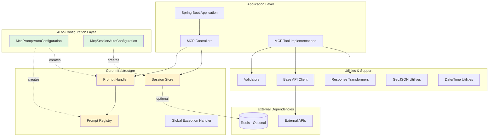
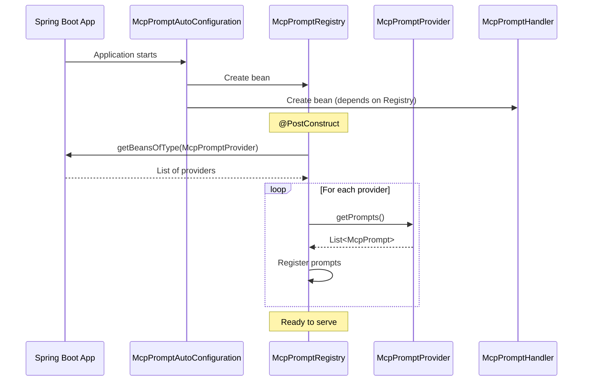
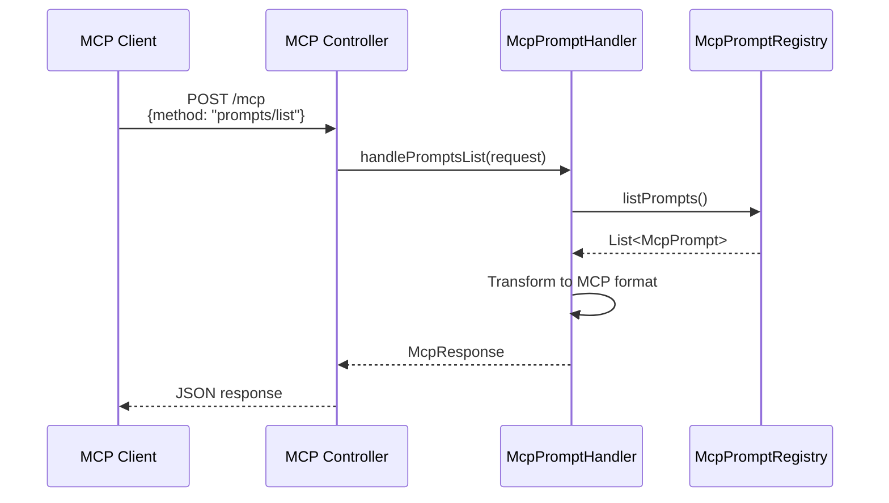
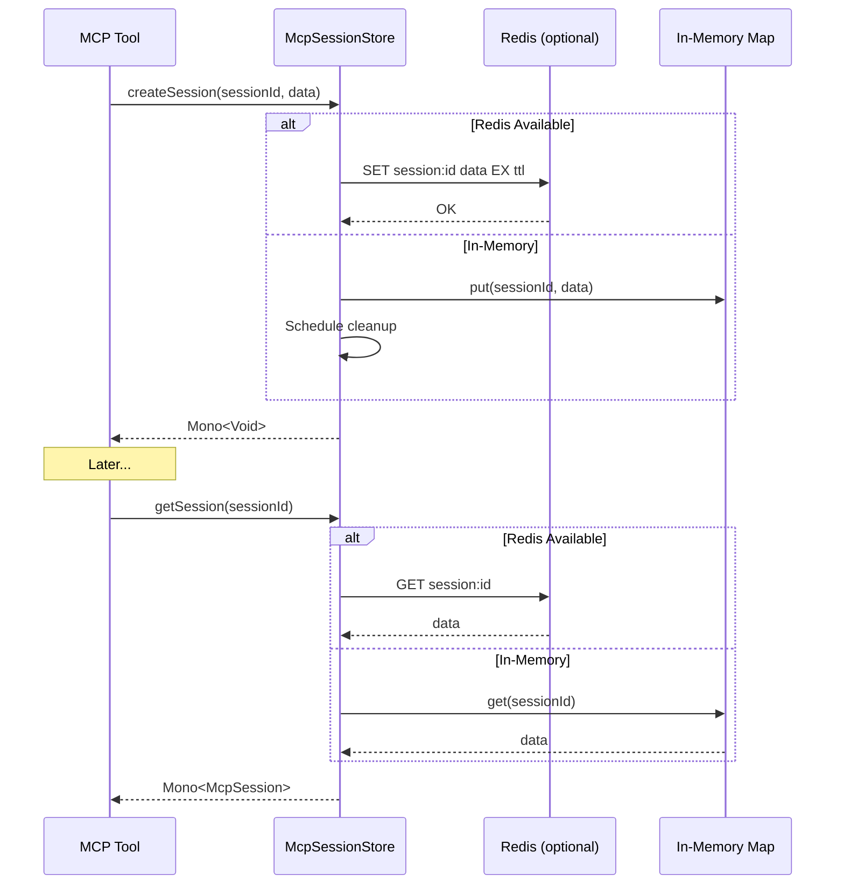

# Architecture Overview

## System Architecture

The `sbb-mcp-commons` library follows a modular, layered architecture designed for reusability and extensibility across multiple MCP server implementations.



## Package Structure

```
ch.sbb.mcp.commons
├── prompts/                    # Prompt infrastructure
│   ├── config/                 # Auto-configuration
│   ├── McpPrompt              # Prompt model
│   ├── McpPromptProvider      # Provider interface
│   ├── McpPromptRegistry      # Discovery & registration
│   └── McpPromptHandler       # Request handling
├── session/                    # Session management
│   ├── config/                 # Auto-configuration
│   ├── impl/                   # Implementations
│   ├── McpSession             # Session model
│   └── McpSessionStore        # Storage interface
├── exception/                  # Exception handling
│   ├── McpException           # Base exception
│   ├── McpValidationException # Validation errors
│   └── McpGlobalExceptionHandler
├── validation/                 # Input validation
│   └── Validators             # Static validators
├── client/                     # HTTP client utilities
│   ├── BaseApiClient          # Base client
│   └── WebClientFactory       # WebClient factory
├── transformation/             # Response transformation
│   └── ResponseTransformer    # Transformer interface
├── util/                       # Utilities
│   ├── ArgumentExtractor      # Argument parsing
│   └── DateTimeUtil           # Date/time parsing
├── geo/                        # GeoJSON utilities
│   └── GeoJsonValidator       # Geometry validation
├── protocol/                   # MCP protocol
│   ├── McpRequest             # Request model
│   └── McpResponse            # Response model
├── model/                      # Base models
├── context/                    # Request context
└── core/                       # Core abstractions
```

## Component Interactions

### Prompt Discovery Flow



### MCP Request Handling



### Session Management Flow



## Design Principles

### 1. Auto-Configuration First

All infrastructure components are auto-configured using Spring Boot's `@AutoConfiguration`:

- **Zero Configuration**: Host applications just add the dependency
- **Conditional Beans**: Components activate based on classpath and configuration
- **Sensible Defaults**: Works out-of-the-box with minimal setup

### 2. Reactive Programming

Built on Project Reactor for non-blocking, scalable operations:

- All I/O operations return `Mono<T>` or `Flux<T>`
- Session stores use reactive Redis templates
- API clients use WebClient

### 3. Resilience Patterns

Integrated resilience patterns for production reliability:

- **Circuit Breaker**: Prevents cascading failures
- **Retry Logic**: Automatic retry with exponential backoff
- **Timeouts**: Configurable request timeouts

### 4. Extensibility

Designed for extension without modification:

- **Provider Pattern**: `McpPromptProvider` for custom prompts
- **Strategy Pattern**: `McpSessionStore` implementations
- **Template Pattern**: `BaseApiClient` for custom clients

## Technology Stack

| Component | Technology | Version |
|-----------|-----------|---------|
| Language | Java | 25 |
| Framework | Spring Boot | 3.2.3 |
| Reactive | Project Reactor | (via Spring) |
| Resilience | Resilience4j | 2.1.0 |
| Caching | Redis (optional) | (via Spring Data) |
| Geometry | JTS Topology Suite | 1.19.0 |
| Testing | JUnit 5 + Mockito | (via Spring Boot) |
| Build | Maven | 3.x |

## Configuration Properties

### Session Management

```yaml
mcp:
  session:
    ttl: PT1H                                    # Session time-to-live
    circuit-breaker:
      failure-rate-threshold: 50                 # Circuit breaker threshold (%)
      wait-duration: 60s                         # Wait time in open state
    retry:
      max-attempts: 3                            # Maximum retry attempts
      wait-duration: 100ms                       # Initial retry delay
```

### Redis (Optional)

```yaml
spring:
  data:
    redis:
      host: localhost
      port: 6379
      password: ${REDIS_PASSWORD:}
      timeout: 2000ms
```

## Deployment Considerations

### In-Memory Session Store

**Pros:**
- No external dependencies
- Fast access
- Simple deployment

**Cons:**
- Sessions lost on restart
- Not suitable for multi-instance deployments
- Memory consumption grows with sessions

**Use When:**
- Single instance deployment
- Sessions are short-lived
- Development/testing

### Redis Session Store

**Pros:**
- Persistent across restarts
- Supports multi-instance deployments
- Automatic expiration
- Scalable

**Cons:**
- Requires Redis infrastructure
- Network latency
- Additional operational complexity

**Use When:**
- Production deployments
- Multi-instance/load-balanced setup
- Long-lived sessions
- High availability requirements

## Performance Characteristics

| Operation | In-Memory | Redis |
|-----------|-----------|-------|
| Create Session | ~1μs | ~1-5ms |
| Get Session | ~1μs | ~1-5ms |
| Update Session | ~1μs | ~1-5ms |
| Delete Session | ~1μs | ~1-5ms |
| Throughput | >100k ops/sec | ~10k ops/sec |

## Security Considerations

1. **Input Validation**: All inputs validated before processing
2. **Error Handling**: Sensitive information not exposed in errors
3. **Session Security**: Sessions expire automatically
4. **Redis Security**: Support for password authentication
5. **HTTPS**: Recommended for production deployments

## Monitoring & Observability

### Metrics (via Spring Boot Actuator)

- Session store operations
- Circuit breaker states
- Retry attempts
- HTTP client metrics

### Logging

Structured logging at appropriate levels:
- `INFO`: Normal operations
- `WARN`: Recoverable errors, retries
- `ERROR`: Unrecoverable errors

### Health Checks

- Redis connectivity (when enabled)
- Circuit breaker states
- Session store health
