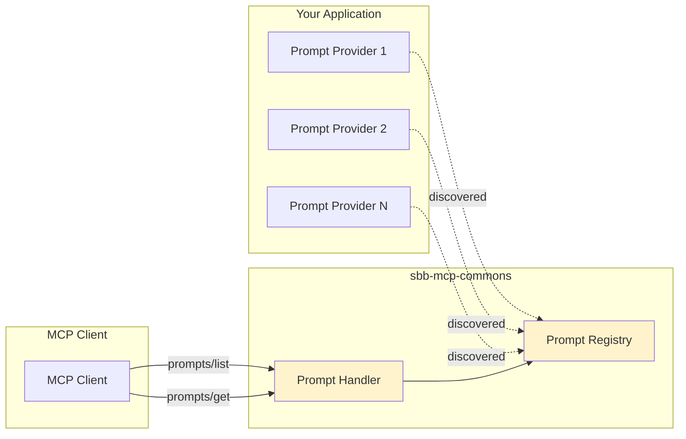

# Prompt Infrastructure Guide

Complete guide to building and managing MCP prompts with `sbb-mcp-commons`.

## Overview

The prompt infrastructure provides:
- **Auto-Discovery**: Automatic prompt registration
- **Type-Safe**: Strongly-typed prompt definitions
- **Template Support**: Dynamic argument substitution
- **MCP Compliant**: Full MCP protocol support

## Architecture



## Creating Prompts

### Basic Prompt

```java
@Component
public class MyPrompts implements McpPromptProvider {
    
    @Override
    public List<McpPrompt> getPrompts() {
        return List.of(
            new McpPrompt(
                "greeting",                          // Unique name
                "Generate a personalized greeting",  // Description
                List.of(                             // Arguments
                    new McpPromptArgument(
                        "name",                      // Argument name
                        "Person's name",             // Description
                        true                         // Required
                    )
                ),
                "Hello, {name}!"                     // Template
            )
        );
    }
}
```

### Prompt with Multiple Arguments

```java
new McpPrompt(
    "find-journey",
    "Find train journeys between stations",
    List.of(
        new McpPromptArgument("from", "Origin station", true),
        new McpPromptArgument("to", "Destination station", true),
        new McpPromptArgument("date", "Travel date (YYYY-MM-DD)", false),
        new McpPromptArgument("time", "Departure time (HH:MM)", false)
    ),
    """
    Find train journeys from {from} to {to}.
    Date: {date}
    Time: {time}
    """
)
```

### Complex Template

```java
new McpPrompt(
    "journey-analysis",
    "Analyze journey options",
    List.of(
        new McpPromptArgument("from", "Origin", true),
        new McpPromptArgument("to", "Destination", true),
        new McpPromptArgument("preferences", "Travel preferences", false)
    ),
    """
    Analyze train journey options from {from} to {to}.
    
    Consider the following preferences:
    {preferences}
    
    Provide:
    1. Fastest route
    2. Most economical option
    3. Scenic route recommendations
    """
)
```

## Organizing Prompts

### Single Provider

```java
@Component
public class JourneyPrompts implements McpPromptProvider {
    
    @Override
    public List<McpPrompt> getPrompts() {
        return List.of(
            findJourneysPrompt(),
            analyzeJourneyPrompt(),
            compareRoutesPrompt()
        );
    }
    
    private McpPrompt findJourneysPrompt() {
        return new McpPrompt(/* ... */);
    }
    
    private McpPrompt analyzeJourneyPrompt() {
        return new McpPrompt(/* ... */);
    }
    
    private McpPrompt compareRoutesPrompt() {
        return new McpPrompt(/* ... */);
    }
}
```

### Multiple Providers by Domain

```java
// Journey-related prompts
@Component
public class JourneyPrompts implements McpPromptProvider {
    @Override
    public List<McpPrompt> getPrompts() {
        return List.of(/* journey prompts */);
    }
}

// Station-related prompts
@Component
public class StationPrompts implements McpPromptProvider {
    @Override
    public List<McpPrompt> getPrompts() {
        return List.of(/* station prompts */);
    }
}

// Ticket-related prompts
@Component
public class TicketPrompts implements McpPromptProvider {
    @Override
    public List<McpPrompt> getPrompts() {
        return List.of(/* ticket prompts */);
    }
}
```

## Template Substitution

### Simple Substitution

Template:
```
Hello, {name}!
```

Arguments:
```json
{
  "name": "Alice"
}
```

Result:
```
Hello, Alice!
```

### Multiple Arguments

Template:
```
Find journeys from {from} to {to} on {date}
```

Arguments:
```json
{
  "from": "Zurich",
  "to": "Geneva",
  "date": "2026-01-10"
}
```

Result:
```
Find journeys from Zurich to Geneva on 2026-01-10
```

### Optional Arguments

When optional arguments are not provided, the placeholder remains:

Template:
```
Search for {type} near {location} within {radius}km
```

Arguments (radius omitted):
```json
{
  "type": "restaurants",
  "location": "Bern"
}
```

Result:
```
Search for restaurants near Bern within {radius}km
```

## MCP Protocol Integration

### prompts/list Request

```json
{
  "jsonrpc": "2.0",
  "id": "1",
  "method": "prompts/list"
}
```

Response:
```json
{
  "jsonrpc": "2.0",
  "id": "1",
  "result": {
    "prompts": [
      {
        "name": "find-journey",
        "description": "Find train journeys",
        "arguments": [
          {
            "name": "from",
            "description": "Origin station",
            "required": true
          },
          {
            "name": "to",
            "description": "Destination station",
            "required": true
          }
        ]
      }
    ]
  }
}
```

### prompts/get Request

```json
{
  "jsonrpc": "2.0",
  "id": "2",
  "method": "prompts/get",
  "params": {
    "name": "find-journey",
    "arguments": {
      "from": "Zurich",
      "to": "Geneva"
    }
  }
}
```

Response:
```json
{
  "jsonrpc": "2.0",
  "id": "2",
  "result": {
    "name": "find-journey",
    "description": "Find train journeys",
    "arguments": [...],
    "messages": [
      {
        "role": "user",
        "content": {
          "type": "text",
          "text": "Find train journeys from Zurich to Geneva"
        }
      }
    ]
  }
}
```

## Best Practices

### 1. Descriptive Names

✅ Good:
```java
"find-journeys-between-stations"
"analyze-journey-options"
"compare-ticket-prices"
```

❌ Bad:
```java
"prompt1"
"journey"
"search"
```

### 2. Clear Descriptions

✅ Good:
```java
"Find train journeys between two stations with optional date and time filters"
```

❌ Bad:
```java
"Find journeys"
```

### 3. Meaningful Argument Names

✅ Good:
```java
new McpPromptArgument("departureStation", "Name of the departure station", true)
```

❌ Bad:
```java
new McpPromptArgument("s1", "Station", true)
```

### 4. Template Clarity

✅ Good:
```
Find train journeys from {departureStation} to {arrivalStation}.
Travel date: {date}
Departure time: {time}
```

❌ Bad:
```
{departureStation} {arrivalStation} {date} {time}
```

### 5. Argument Validation

Validate required vs optional arguments:

```java
private McpPrompt createPrompt() {
    return new McpPrompt(
        "search-places",
        "Search for places",
        List.of(
            new McpPromptArgument("query", "Search query", true),      // Required
            new McpPromptArgument("radius", "Search radius in km", false),  // Optional
            new McpPromptArgument("limit", "Max results", false)       // Optional
        ),
        "Search for {query} within {radius}km, limit {limit} results"
    );
}
```

## Error Handling

### Duplicate Prompt Names

```java
// This will throw IllegalArgumentException at startup
@Component
public class Provider1 implements McpPromptProvider {
    public List<McpPrompt> getPrompts() {
        return List.of(new McpPrompt("duplicate-name", ...));
    }
}

@Component
public class Provider2 implements McpPromptProvider {
    public List<McpPrompt> getPrompts() {
        return List.of(new McpPrompt("duplicate-name", ...));  // ❌ Error!
    }
}
```

Error:
```
IllegalArgumentException: Prompt already registered: duplicate-name
```

### Invalid Prompt Names

Avoid special characters and spaces:

✅ Good: `find-journey`, `search_places`, `analyze.route`  
❌ Bad: `find journey`, `search@places`, `analyze route!`

## Testing Prompts

### Unit Test

```java
@Test
void shouldCreateValidPrompt() {
    // Given
    McpPromptProvider provider = new JourneyPrompts();
    
    // When
    List<McpPrompt> prompts = provider.getPrompts();
    
    // Then
    assertThat(prompts).isNotEmpty();
    assertThat(prompts.get(0).name()).isEqualTo("find-journey");
    assertThat(prompts.get(0).arguments()).hasSize(2);
}
```

### Integration Test

```java
@SpringBootTest
class PromptIntegrationTest {
    
    @Autowired
    private McpPromptRegistry registry;
    
    @Test
    void shouldDiscoverAllPrompts() {
        List<McpPrompt> prompts = registry.listPrompts();
        assertThat(prompts).hasSizeGreaterThan(0);
    }
    
    @Test
    void shouldRetrievePromptByName() {
        Optional<McpPrompt> prompt = registry.getPrompt("find-journey");
        assertThat(prompt).isPresent();
    }
}
```

## Advanced Patterns

### Dynamic Prompts

```java
@Component
public class DynamicPrompts implements McpPromptProvider {
    
    private final StationService stationService;
    
    @Override
    public List<McpPrompt> getPrompts() {
        // Generate prompts based on available stations
        List<String> popularStations = stationService.getPopularStations();
        
        return popularStations.stream()
            .map(this::createStationPrompt)
            .collect(Collectors.toList());
    }
    
    private McpPrompt createStationPrompt(String station) {
        return new McpPrompt(
            "departures-" + station.toLowerCase(),
            "Get departures from " + station,
            List.of(),
            "Show me the next departures from " + station
        );
    }
}
```

### Conditional Prompts

```java
@Component
@ConditionalOnProperty(name = "features.advanced-search", havingValue = "true")
public class AdvancedSearchPrompts implements McpPromptProvider {
    @Override
    public List<McpPrompt> getPrompts() {
        return List.of(/* advanced prompts */);
    }
}
```

## Troubleshooting

### Prompts Not Appearing

**Problem**: `prompts/list` returns empty

**Solutions**:
1. Verify provider is a `@Component`
2. Check package scanning includes provider
3. Ensure `getPrompts()` returns non-empty list
4. Check application logs for registration errors

### Template Not Substituting

**Problem**: Placeholders like `{name}` not replaced

**Solutions**:
1. Verify argument names match template placeholders exactly
2. Check arguments are provided in `prompts/get` request
3. Ensure placeholders use curly braces: `{name}` not `$name` or `%name%`

## See Also

- [Quick Start Guide](quick-start.md)
- [Auto-Configuration Guide](auto-configuration.md)
- [API Reference](../api/README.md)
