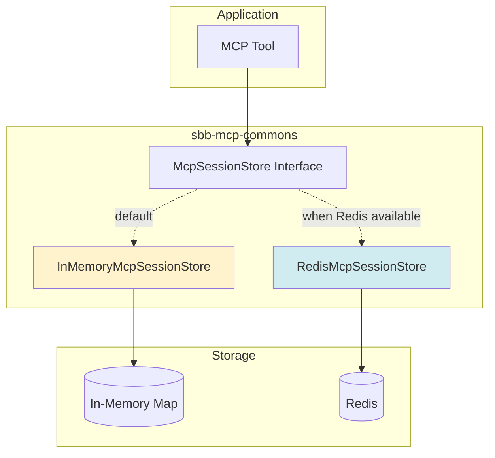

# Session Management Guide

Complete guide to managing stateful sessions with `sbb-mcp-commons`.

## Overview

The session management infrastructure provides:
- **Reactive Storage**: Non-blocking session operations
- **Multiple Backends**: In-memory or Redis
- **Auto-Configuration**: Automatic setup based on dependencies
- **TTL Support**: Automatic session expiration
- **Resilience**: Circuit breaker and retry patterns

## Architecture



## Basic Usage

### Creating a Session

```java
@Component
public class MyTool {
    
    private final McpSessionStore sessionStore;
    
    public Mono<ToolResult> execute(String sessionId, Map<String, Object> data) {
        McpSession session = new McpSession(sessionId, data);
        
        return sessionStore.createSession(sessionId, session)
            .thenReturn(ToolResult.success("Session created"));
    }
}
```

### Retrieving a Session

```java
public Mono<ToolResult> getSessionData(String sessionId) {
    return sessionStore.getSession(sessionId)
        .map(session -> ToolResult.success(session.state()))
        .switchIfEmpty(Mono.just(ToolResult.error("Session not found")));
}
```

### Updating a Session

```java
public Mono<ToolResult> updateSession(String sessionId, String key, Object value) {
    return sessionStore.getSession(sessionId)
        .flatMap(session -> {
            Map<String, Object> newState = new HashMap<>(session.state());
            newState.put(key, value);
            
            McpSession updatedSession = new McpSession(
                sessionId,
                newState,
                session.createdAt(),
                Instant.now()
            );
            
            return sessionStore.updateSession(sessionId, updatedSession);
        })
        .thenReturn(ToolResult.success("Session updated"));
}
```

### Deleting a Session

```java
public Mono<Void> cleanup(String sessionId) {
    return sessionStore.deleteSession(sessionId);
}
```

## Session Model

```java
public record McpSession(
    String id,
    Map<String, Object> state,
    Instant createdAt,
    Instant lastAccessedAt
) {
    // Convenience constructor
    public McpSession(String id, Map<String, Object> state) {
        this(id, state, Instant.now(), Instant.now());
    }
}
```

## Configuration

### In-Memory Store (Default)

No configuration needed - automatically used when Redis is not available:

```yaml
mcp:
  session:
    ttl: PT1H  # 1 hour TTL
```

### Redis Store

Add Redis dependency to `pom.xml`:

```xml
<dependency>
    <groupId>org.springframework.boot</groupId>
    <artifactId>spring-boot-starter-data-redis-reactive</artifactId>
</dependency>
```

Configure Redis connection:

```yaml
spring:
  data:
    redis:
      host: localhost
      port: 6379
      password: ${REDIS_PASSWORD:}
      timeout: 2000ms

mcp:
  session:
    ttl: PT2H  # 2 hour TTL
    circuit-breaker:
      failure-rate-threshold: 50
      wait-duration: 60s
    retry:
      max-attempts: 3
      wait-duration: 100ms
```

## Common Patterns

### Get-or-Create Pattern

```java
public Mono<McpSession> getOrCreateSession(String sessionId) {
    return sessionStore.getSession(sessionId)
        .switchIfEmpty(Mono.defer(() -> {
            McpSession newSession = new McpSession(
                sessionId,
                new HashMap<>()
            );
            return sessionStore.createSession(sessionId, newSession)
                .thenReturn(newSession);
        }));
}
```

### Stateful Conversation

```java
@Component
public class ConversationTool {
    
    private final McpSessionStore sessionStore;
    
    public Mono<ToolResult> chat(String sessionId, String message) {
        return getOrCreateSession(sessionId)
            .flatMap(session -> {
                // Get conversation history
                @SuppressWarnings("unchecked")
                List<String> history = (List<String>) session.state()
                    .getOrDefault("messages", new ArrayList<>());
                
                // Add new message
                history.add(message);
                
                // Update session
                Map<String, Object> newState = new HashMap<>(session.state());
                newState.put("messages", history);
                
                McpSession updated = new McpSession(
                    sessionId,
                    newState,
                    session.createdAt(),
                    Instant.now()
                );
                
                return sessionStore.updateSession(sessionId, updated)
                    .thenReturn(ToolResult.success(processConversation(history)));
            });
    }
}
```

### Multi-Step Workflow

```java
public Mono<ToolResult> executeWorkflow(String sessionId, String step, Map<String, Object> data) {
    return getOrCreateSession(sessionId)
        .flatMap(session -> {
            Map<String, Object> workflow = new HashMap<>(session.state());
            workflow.put("currentStep", step);
            workflow.put("stepData_" + step, data);
            
            // Check if workflow is complete
            if (isWorkflowComplete(workflow)) {
                return sessionStore.deleteSession(sessionId)
                    .thenReturn(ToolResult.success(finalizeWorkflow(workflow)));
            } else {
                McpSession updated = new McpSession(sessionId, workflow);
                return sessionStore.updateSession(sessionId, updated)
                    .thenReturn(ToolResult.success("Step " + step + " completed"));
            }
        });
}
```

## Resilience Features

### Circuit Breaker

Automatically configured for Redis operations:

```yaml
mcp:
  session:
    circuit-breaker:
      failure-rate-threshold: 50      # Open circuit at 50% failure rate
      wait-duration: 60s               # Wait 60s before retry
```

States:
- **CLOSED**: Normal operation
- **OPEN**: Failing fast, not calling Redis
- **HALF_OPEN**: Testing if Redis recovered

### Retry Logic

Automatic retry with exponential backoff:

```yaml
mcp:
  session:
    retry:
      max-attempts: 3                  # Retry up to 3 times
      wait-duration: 100ms             # Initial delay 100ms
```

Backoff: 100ms → 200ms → 400ms

## Testing

### Unit Test with Mock

```java
@Test
void shouldCreateSession() {
    // Given
    McpSessionStore store = mock(McpSessionStore.class);
    when(store.createSession(any(), any())).thenReturn(Mono.empty());
    
    MyTool tool = new MyTool(store);
    
    // When
    StepVerifier.create(tool.execute("session-1", Map.of("key", "value")))
        .expectNextMatches(result -> result.isSuccess())
        .verifyComplete();
    
    // Then
    verify(store).createSession(eq("session-1"), any(McpSession.class));
}
```

### Integration Test

```java
@SpringBootTest
class SessionIntegrationTest {
    
    @Autowired
    private McpSessionStore sessionStore;
    
    @Test
    void shouldStoreAndRetrieveSession() {
        String sessionId = "test-session";
        Map<String, Object> data = Map.of("key", "value");
        McpSession session = new McpSession(sessionId, data);
        
        StepVerifier.create(
            sessionStore.createSession(sessionId, session)
                .then(sessionStore.getSession(sessionId))
        )
        .expectNextMatches(retrieved -> 
            retrieved.id().equals(sessionId) &&
            retrieved.state().get("key").equals("value")
        )
        .verifyComplete();
    }
}
```

## Best Practices

### 1. Use Appropriate TTL

```yaml
# Short-lived sessions (e.g., form wizards)
mcp.session.ttl: PT15M  # 15 minutes

# Medium-lived sessions (e.g., conversations)
mcp.session.ttl: PT1H   # 1 hour

# Long-lived sessions (e.g., user preferences)
mcp.session.ttl: PT24H  # 24 hours
```

### 2. Clean Up Sessions

Always clean up when done:

```java
public Mono<ToolResult> completeWorkflow(String sessionId) {
    return processWorkflow(sessionId)
        .flatMap(result -> 
            sessionStore.deleteSession(sessionId)
                .thenReturn(result)
        );
}
```

### 3. Handle Missing Sessions Gracefully

```java
public Mono<ToolResult> getSessionData(String sessionId) {
    return sessionStore.getSession(sessionId)
        .map(session -> ToolResult.success(session.state()))
        .switchIfEmpty(Mono.just(
            ToolResult.error("Session expired or not found. Please start over.")
        ));
}
```

### 4. Immutable State Updates

Always create new state maps:

```java
// ✅ Good - creates new map
Map<String, Object> newState = new HashMap<>(session.state());
newState.put("key", "value");

// ❌ Bad - mutates original
session.state().put("key", "value");
```

## Troubleshooting

### Sessions Not Persisting

**Problem**: Sessions disappear immediately

**Solutions**:
1. Check TTL configuration
2. Verify Redis connection (if using Redis)
3. Check for errors in application logs

### Redis Connection Errors

**Problem**: `RedisConnectionException`

**Solutions**:
1. Verify Redis is running: `redis-cli ping`
2. Check host/port configuration
3. Verify network connectivity
4. Check Redis authentication

### Memory Issues (In-Memory Store)

**Problem**: High memory usage

**Solutions**:
1. Reduce session TTL
2. Implement session cleanup
3. Switch to Redis for production
4. Monitor session count

## Monitoring

### Metrics

Monitor these metrics (via Spring Boot Actuator):

- Session creation rate
- Session retrieval rate
- Session update rate
- Session deletion rate
- Circuit breaker state
- Retry attempts

### Logging

Enable debug logging:

```yaml
logging:
  level:
    ch.sbb.mcp.commons.session: DEBUG
```

## See Also

- [Quick Start Guide](quick-start.md)
- [Auto-Configuration Guide](auto-configuration.md)
- [Architecture Overview](../architecture/README.md)
